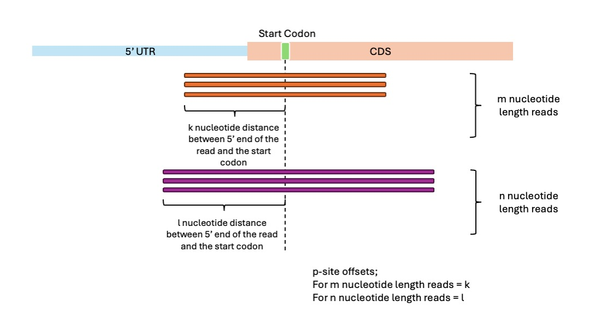
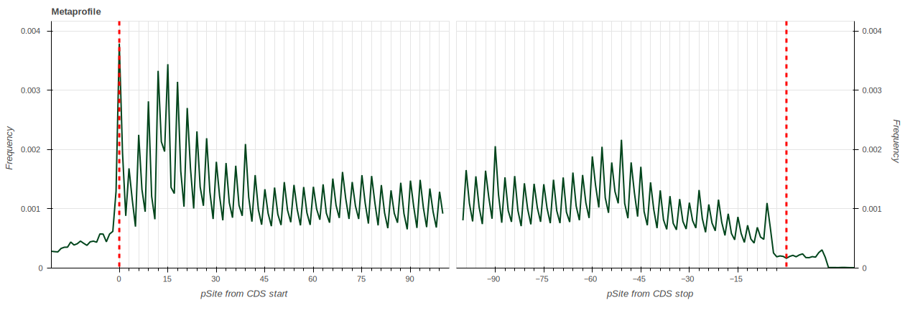
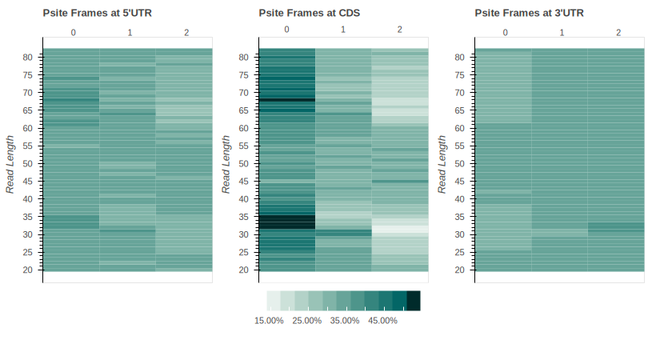
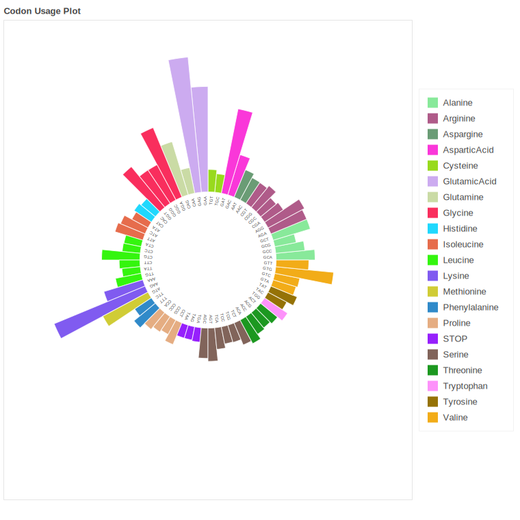
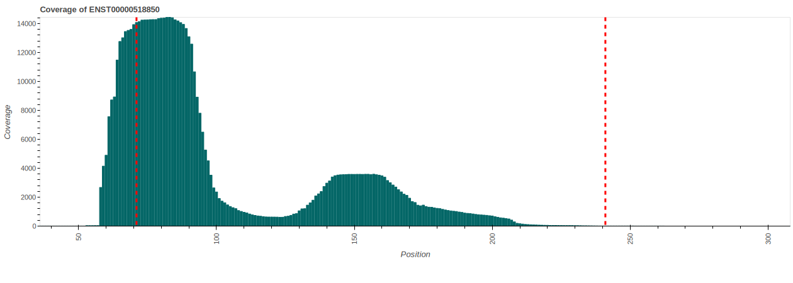

# Martian Ribosome Profiling Module

## Calculation of the P-sites
In Martian p-sites are identifying by the calculated p-site offsets in each different length of reads. These p-site offsets are calculating by the distance of 'ATG' codons from the relative start positions of transcripts in each read length. You can see the explanatory diagram below;



## Results

Martian is doing 2 analyses for each sample. First, it is analysing all reads without any length filtering in the alignment files to get ribosome profiling results and reporting these results to the folder named **"All"**. After this it is finding the 'Monosome Length' of the Ribosome Protected Fragments (RPFs) for the given samples and filtering RPFs that belongs to monosomes and repeating the analsyis for those reads and exporting these results on another folder named **"Filtered"**.

For each analysis Martian reporting multiple tables that can be used for further analyses.

## Tables

!! ALL THE NUMBERS REPORTED BELOW ARE FOR PRESENTATION AND THEY DO NOT REFLECTS THE REAL EXPERIMENTAL RESULTS !!

### *"Sample"*_psiteData.csv

transcript | read_start | read_end | read_len | read_id | cds_start | cds_end | min_len | psite5 | psite3 | offset | psiteFromStart | frame | read_region | codon
--- | --- | --- | --- | --- | --- | --- | --- | --- | --- | --- | --- | --- | --- | --- 
ENST00000012345 | 15 | 45 | 30 | READ1 | 12 | 114 | 20 | 9 | 21 | 9 | 24 | 0 | CDS | CTG
ENST00000012345 | 3 | 33 | 30 |READ2 | 12 | 114 | 20 | 9 | 21 | 9 | 12 | 0 | CDS | ATG
ENST00000067890 | 256 | 291 | 36 | READ3 | 205 | 1569 | 20 | 13 | 22 | 13 | 269 | 1 | CDS | GGG
... | ... | ... | ... | ... | ... | ... | ... | ... | ... | ... | ... | ... | ... | ...
ENST00000045678 | 128 | 155 | 28 | READ1234 | 237 | 618 | 20 | 13 | 14 | 13 | 141 | 0 | UTR5 | AGA
... | ... | ... | ... | ... | ... | ... | ... | ... | ... | ... | ... | ... | ... | ...

This is the **MASTER FILE** for ribosome profiling results. All other results are calculated by using information in this file. The columns are in order;
- **transcript:** Transcript ID of the RPF that aligned to
- **read_start:** The position where the RPF starting on the transcript that aligned. Since python indexes are starting from "0" minimum nucleotide position in each transcript is **"0"**
- **read_end:** The position of the last nucleotide of the RPF on the transcript that aligned.
- **read_len:** Length of the RPF
- **read_id:** ID of the RPF in the alignment (.bam) file
- **cds_start:** Start position of the Coding Region (CDS) of the relative transcript. Since python indexes are starting from "0" minimum nucleotide position in each transcript is **"0"** hence CDS start in the gene browsers can be **"cds_start + 1"**
- **cds_end:** Last nucleotide position of the Coding Region (CDS) of the relative transcript. Since python indexes are starting from "0" minimum nucleotide position in each transcript is **"0"** hence CDS end in the gene browsers can be **"cds_end + 1"**
- **min_len:** Minimum RPF length in that relative transcript
- **psite5:** Calculated p-site offset from 5' for relative **'read length'**
- **psite3:** Calculated p-site offset from 3' for relative **'read length'**
- **offset:** Selected offset (between psite5 and psite3) with respect to one that most representative for relative **'read length'**
- **psiteFromStart:** Position of the p-site for given RPF. This can be calculated by **"read start + offset"**
- **frame:** Frame information (0, 1, 2) that calculated from the 3nt distance from cds start of the given p-site for the RPF. "0" means RPF is in correct frame while "1" and "2" means shifted by 1 and 2 nucleotide.
- **read_region:** Information about in which region for that given RPF.
- **codon:** Codon information of given RPF with respect to position of its p-site

### *"Sample"*_AminoList_CDS.csv

transcript | codon | aminoAcid
--- | --- | ---
ENST00000012345 | ATG | Methionine
ENST00000012345 | AAG | Lysine
ENST00000067890 | ATG | Methionine
ENST00000067890 | AAG | Lysine
... | ... | ...

Amino acid list table contains **transcriptID**, **codon** and **amino acid** information for each read (Each row in the table represents one read) that is in "Coding Region (CDS)" of transcripts.

### *"Sample"*_counts.csv

transcript | count | cdsLength | RPKM
--- | --- | --- | ---
ENST00000012345 | 678910 | 123 | 4567
ENST00000067890 | 123456 | 7890 | 123
... | ... | ... | ...

Counts table contains **transcriptID**, **RPFs counts**, **CDS length of the transcript** and **Normalized RPFs count by RPKM method**.<br />
***The counts are coming from "both" in-frame and not inframe RPFs***.

### *"Sample"*_inFrameCounts.csv

transcript | count | cdsLength | RPKM
--- | --- | --- | ---
ENST00000012345 | 678910 | 123 | 4567
ENST00000067890 | 123456 | 7890 | 123
... | ... | ... | ...

Counts table contains **transcriptID**, **RPFs counts**, **CDS length of the transcript** and **Normalized RPFs count by RPKM method**.<br />
***The counts are coming from "just" in-frame RPFs***.

### *"Sample"*_coveredArea.csv

transcript | coveredArea
--- | --- 
ENST00000012345 | 0.678
ENST00000067890 | 0.123
... | ... 

This table contains information about how much of the area covered at least 1 read for each transcript.

### *"Sample"*_psitesByLength.csv

read_len | psite5 | psite3
--- | --- | ---
29 | 13 | 15
30 | 13 | 17
31 | 13 | 17
32 | 13 | 18
... | ... | ...

This table contains the information about calculated p-site offsets for each length.

### *"Sample"* FrameCDS.csv

Lengths | Frames | rate
--- | --- | ---
33 | 0 | 0.03
33 | 1 | 0.01
33 | 2 | 0.01
34 | 0 | 0.03
... | ... | ...

Frame CDS table is contains percentage of reads for each length and each frame. This table is later using for the prepare heatmaps and for for the detecting of the monosome length.

### *"Sample"*_metaprofileStart.csv and *"Sample"*_metaprofileEnd.csv

psite_from_cds_start | rate
--- | --- 
-1 | 0.001
0 | 0.003
1 | 0.001
2 | 0.0008
... | ... 

psite_from_cds_stop | rate
--- | --- 
-1 | 0.001
0 | 0.003
1 | 0.001
2 | 0.0008
... | ... 

These two files contains the rate of the reads' p-site with respect to start and stop positions of transcripts' cds. To get this result all the reads are grouping with respect to their relative distance from start and stop positions in every transcript. Then for every distance value the ratio of total reads in that specific distance divided by total number of the reads. If we have to formulate this;

$$\textrm{Distance Ratio From CDS Start}  = \left(\textrm{For Each Nucleotide l} \sum_{k=1}^n \textrm{p-sites in }transcript_k(nucleotide_l) \right) / \left( \sum \textrm{p-site} \right)$$ <br />
where k = transcript, l = nucleotide position with respect to relative CDS starts

### *"Sample"*_coverages.lz4

transcriptID | coverage
--- | --- 
ENST00000012345 | [0,0,..,2,3,..,0,0]
ENST00000067890 | [0,0,..,21,12,..,0,0]
... | ... 


Coverages file contains the coverage of reads in a list for every transcript. Since the file is big the data saved in zipped parquet data format (.lz4). Please follow the instructions below if you not familiar with this format.

First please install "python" (https://www.python.org) <br />
After installing it please install "polars" library (https://pola.rs) <br />

```python
import polars
coverageData = polars.read_parquet('Sample_coverages.lz4')
print(coverageData)
```
To get coverage info of a specific transcript as an array

```python
import polars
coverageData = polars.read_parquet('Sample_coverages.lz4')
result = coverageData.filter(polars.col("transcriptID") == "ENST00000420542").select("coverage").to_numpy()[0][0]
```


## Plots

Each plot in this section is reporting in HTML format and each of them has interactive properties and downloadable as **Scalable Vector Graphics (.svg)** from the html report itself. In here static plots are used to explain meanings of each plot.

### Length Distribution Plot


Length Distribution plot shows how frequency of read lengths of RPFs in the given sample. Since RiboLace GelFree kit (https://www.immaginabiotech.com/our-technologies/ribolace) allows longer reads detection disome lengths can be seen in this plot. Martian is designed to be able to do analysis for also disome length RPFs.

### Read Region & Frame Plot


Read Region & Frame plot gives information about the region (5'UTRs,CDS or 3'UTRs) of the RPFs in their respective transcripts in the samples. The percentages with respect to total number of reads can be seen in the bottom right part of each panel.

### Metaprofile Plot



Metaprofile plot contains two sub-plot. Left side of metaprofile plot shows the distance from relative start for each transcript, and for each nucleotide position the frequency shows the ratio of how many p-site (each p-site from an individual RPF) found in that specific location between total number of RPFs. Right side of metaprofile shows the distance from the relative stop position for each transcripts and the ratio of p-site in each nucleotide position between totoal number of RPFs.

### Heatmap"s"

Martian results contains two different heatmaps. Both heapmaps contains read lengths of RPFs that can found in the sample in the Y-Axis and frame information of those reads in the X-Axis. The difference between them while total-Heatmap shows the values that normalized in total number of RPFs, row-Heatmap shows the values that normalized in each read length individually.

### Total-Heatmap


### Row-Heatmap



### Covered Area Plot


This plot shows how much of the area is covered at least **one** RPF in the given transcripts. X-Axis contains individual transcripts while Y-Axis shows the percentage of their covered areas. To ease of read transcripts are colored with respect to their covered areas.

### Codon Usage Plot



### Coverage of Transcripts



Martian reports coverage plots for the top 20 transcripts (by their RPKM values) in the reports. In these plots start and stop for CDS region are highlighted by vertical lines.

