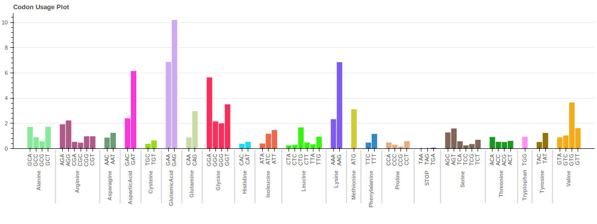

# Martian Ribosome Profiling Module

# Index of Contents

- [Results](#results)
- [Tables](#tables)
  - [File: "Sample"_psiteData](#file-sample_psitedata)
  - [File: "Sample"_AminoList_CDS](#file-sample_aminolist_cds)
  - [File: "Sample"_counts](#file-sample_counts)
  - [File: "Sample"_inFrameCounts](#file-sample_inframecounts)
  - [File: "Sample"_coveredArea](#file-sample_coveredarea)
  - [File: "Sample"_psitesByLength](#file-sample_psitesbylength)
  - [File: "Sample" FrameCDS](#file-sample-framecds)
  - [File: "Sample"_metaprofileStart and "Sample"_metaprofileEnd](#file-sample_metaprofilestart-and-sample_metaprofileend)
  - [How to read Coverage "Sample"_coverages.lz4 file](#how-to-read-coverage-sample_coverageslz4-file)
- [Plots](#plots)
  - [Length Distribution Plot](#length-distribution-plot)
  - [Read Region & Frame Plot](#read-region--frame-plot)
  - [Metaprofile Plot](#metaprofile-plot)
  - [Heatmaps](#heatmaps)
    - [Total-Heatmap](#total-heatmap)
    - [Row-Heatmap](#row-heatmap)
  - [Covered Area Plot](#covered-area-plot)
  - [Coverage of Transcripts](#coverage-of-transcripts)
  - [Codon Usage Plot](#codon-usage-plot)
  
## Calculation of the P-sites

Martian<sup>TM</sup> is the cutting-edge python-based RIBO-suite. This tool is revolutionizing gene expression analysis, data mining, and data visualization offering a gateway to a vast sea of invaluable big data collected through Immagina's pioneering technologies.
The most distinct feature of tools for RiboSeq analysis is the calculation of P-sites.<br />
The P-site (peptidyl) is the second binding site for tRNA within the ribosome. The other two sites are called A-site (aminoacyl) and the E-site (exit). During translation, the P-site contains the tRNA attached to the elongating polypeptide chain.<br />
<br />
In Martian, P-sites are identified using a P-site offset computed for each different length of reads. These P-site offsets are calculated by the distance of the start codon (Translation Initiation Sites) from the relative start positions of RPFs in each read length, as described in https://doi.org/10.1371/journal.pcbi.1006169. You can see the explanatory diagram below:<br />
<br />


## Results

Martian performs two analyses for each sample. First, it analyzes all reads without any length filtering to get ribosome profiling results (folder named “All”). After this, it finds the ‘Monosome Length’ of the Ribosome Protected Fragments (RPFs) for the given samples from the information [Frame CDS table](#sample-framecds), filters RPFs in monosome lengths, repeats the analysis for those reads, and exports these results in another folder named “Filtered”.

For each analysis, Martian reports multiple tables that can be used for further analyses.

## Tables

!! ALL THE NUMBERS REPORTED BELOW ARE FOR PRESENTATION AND THEY DO NOT REFLECT THE REAL EXPERIMENTAL RESULTS !!

### File: *"Sample"*_psiteData 
[Download Example Table](https://github.com/ImmaginaBiotechnology/Documents/blob/main/Martian_example_Tables/Sample_psiteData.csv)

transcript | read_start | read_end | read_len | read_id | cds_start | cds_end | min_len | psite5 | psite3 | offset | psiteFromStart | frame | read_region | codon
--- | --- | --- | --- | --- | --- | --- | --- | --- | --- | --- | --- | --- | --- | --- 
ENST00000012345 | 15 | 45 | 30 | READ1 | 12 | 114 | 20 | 9 | 21 | 9 | 24 | 0 | CDS | CTG
ENST00000012345 | 3 | 33 | 30 |READ2 | 12 | 114 | 20 | 9 | 21 | 9 | 12 | 0 | CDS | ATG
ENST00000067890 | 256 | 291 | 36 | READ3 | 205 | 1569 | 20 | 13 | 22 | 13 | 269 | 1 | CDS | GGG
... | ... | ... | ... | ... | ... | ... | ... | ... | ... | ... | ... | ... | ... | ...
ENST00000045678 | 128 | 155 | 28 | READ1234 | 237 | 618 | 20 | 13 | 14 | 13 | 141 | 0 | UTR5 | AGA
... | ... | ... | ... | ... | ... | ... | ... | ... | ... | ... | ... | ... | ... | ...

This is the **MASTER FILE** of the analysis. All the results are calculated using information from this file. The columns are in order;
- **transcript:** Transcript ID on which the RPF maps
- **read_start:** The position where the RPF first nucleotide maps relative to the reference transcript. Since python indexes are starting from "0" minimum nucleotide position in each transcript is **"0"**
- **read_end:** The position of the last nucleotide of the RPF maps on the reference. Since python indexes are starting from "0" minimum nucleotide position in each transcript is **"0"** hence CDS end in the gene browsers can be **"read_end + 1"**
- **read_len:** Length of the RPF
- **read_id:** ID of the RPF in the alignment (.bam) file
- **cds_start:** Start position of the Coding Region (CDS) of the relative transcript. Since python indexes are starting from "0" minimum nucleotide position in each transcript is **"0"** hence CDS start in the gene browsers can be **"cds_start + 1"**
- **cds_end:** Last nucleotide position of the Coding Region (CDS) of the relative transcript. Since python indexes are starting from "0" minimum nucleotide position in each transcript is **"0"** hence CDS end in the gene browsers can be **"cds_end + 1"**
- **min_len:** Minimum RPF length in that relative transcript
- **psite5:** Calculated p-site offset from 5' for relative **'read length'**
- **psite3:** Calculated p-site offset from 3' for relative **'read length'**
- **offset:** Selected offset (the highest frequency between psite5 and psite3) for relative **'read length'**
- **psiteFromStart:** Position of the p-site for given RPF. This can be calculated by **"read start + offset"**
- **frame:** Information of positioning of the p-site. "0" means RPF is in correct frame while "1" and "2" means shifted by 1 and 2 nucleotide.
- **read_region:** Region (CDS, 5'UTR or 3'UTR) to which the RPF belongs.
- **codon:** Codon corresponding to the calculated p-site(PsiteFromStart)

### File: *"Sample"*_AminoList_CDS    
[Download Example Table](https://github.com/ImmaginaBiotechnology/Documents/blob/main/Martian_example_Tables/Sample_AminoList_CDS.csv)

transcript | codon | aminoAcid
--- | --- | ---
ENST00000012345 | ATG | Methionine
ENST00000012345 | AAG | Lysine
ENST00000067890 | ATG | Methionine
ENST00000067890 | AAG | Lysine
... | ... | ...

The codon table contains **transcriptID**, **codon** and **amino acid** information for each read (Each row in the table represents one read) that is in "Coding Region (CDS)" of transcripts.

### File: *"Sample"*_counts
[Download Example Table](https://github.com/ImmaginaBiotechnology/Documents/blob/main/Martian_example_Tables/Sample_counts.csv)

transcript | count | cdsLength | RPKM
--- | --- | --- | ---
ENST00000012345 | 678910 | 123 | 4567
ENST00000067890 | 123456 | 7890 | 123
... | ... | ... | ...

Counts table contains **transcriptID**, **RPFs counts**, **CDS length of the transcript** and **Normalized RPFs count by RPKM method**.<br />
***The counts are coming from "both" in-frame and not in-frame RPFs***.

### File: *"Sample"*_inFrameCounts
[Download Example Table](https://github.com/ImmaginaBiotechnology/Documents/blob/main/Martian_example_Tables/Sample_inFrameCounts.csv)

transcript | count | cdsLength | RPKM
--- | --- | --- | ---
ENST00000012345 | 678910 | 123 | 4567
ENST00000067890 | 123456 | 7890 | 123
... | ... | ... | ...

Counts table contains **transcriptID**, **RPFs counts**, **CDS length of the transcript** and **Normalized RPFs count by RPKM method**.<br />
***The counts are coming from "just" in-frame RPFs***.

### File: *"Sample"*_coveredArea
[Download Example Table](https://github.com/ImmaginaBiotechnology/Documents/blob/main/Martian_example_Tables/Sample_coveredArea.csv)

transcript | coveredArea
--- | --- 
ENST00000012345 | 0.678
ENST00000067890 | 0.123
... | ... 

This table contains information about how much of the area covered at least 1 read for each transcript. (Minimum = 0, Maximum = 1)

### File: *"Sample"*_psitesByLength
[Download Example Table](https://github.com/ImmaginaBiotechnology/Documents/blob/main/Martian_example_Tables/Sample_psitesByLength.csv)

read_len | psite5 | psite3
--- | --- | ---
29 | 13 | 15
30 | 13 | 17
31 | 13 | 17
32 | 13 | 18
... | ... | ...

This table contains the information about calculated p-site offsets for each length.

### File: *"Sample"* FrameCDS
[Download Example Table](https://github.com/ImmaginaBiotechnology/Documents/blob/main/Martian_example_Tables/Sample_FrameCDS.csv)

Lengths | Frames | rate
--- | --- | ---
33 | 0 | 0.03
33 | 1 | 0.01
33 | 2 | 0.01
34 | 0 | 0.03
... | ... | ...

Frame CDS table contains percentage of the reads for each length and each frame. This table is later used for the preparation of heatmaps and for the detection of the monosome length by identifiying the **Length** that has highest **rate** in **Frame 0**.

### File: *"Sample"*_metaprofileStart and *"Sample"*_metaprofileEnd
[Download Example Table](https://github.com/ImmaginaBiotechnology/Documents/blob/main/Martian_example_Tables/Sample_metaprofileStart.csv)
[Download Example Table](https://github.com/ImmaginaBiotechnology/Documents/blob/main/Martian_example_Tables/Sample_metaprofileEnd.csv)

psite_from_cds_start | rate
--- | --- 
-1 | 0.001
0 | 0.003
1 | 0.001
2 | 0.0008
... | ... 

psite_from_cds_stop | rate
--- | --- 
-1 | 0.001
0 | 0.003
1 | 0.001
2 | 0.0008
... | ... 

These two files contains the rate of the reads' p-site with respect to start and stop positions of transcripts' cds. To get this result all the reads are grouping with respect to their relative distance from start and stop positions in every transcript. Then, for every distance value, the ratio of total reads in that specific distance divided by total number of the reads. If we have to formulate this;

$$\textrm{Distance Ratio From CDS Start}  = \left(\textrm{For Each Nucleotide l} \sum_{k=1}^n \textrm{p-sites in }transcript_k(nucleotide_l) \right) / \left( \sum \textrm{p-site} \right)$$ <br />
where k = transcript, l = nucleotide position with respect to relative CDS starts

### How to read Coverage *"Sample"*_coverages.lz4 file

transcriptID | coverage
--- | --- 
ENST00000012345 | [0,0,..,2,3,..,0,0]
ENST00000067890 | [0,0,..,21,12,..,0,0]
... | ... 


Coverages file contains the coverage of reads in a list for every transcript. Since the file is big the data saved in zipped parquet data format (.lz4). Please follow the instructions below if you not familiar with this format.

First please install "python" (https://www.python.org) <br />
After installing it please install "polars" library (https://pola.rs) <br />

```python
import polars
coverageData = polars.read_parquet('Sample_coverages.lz4')
print(coverageData)
```
To get coverage info of a specific transcript as an array

```python
import polars
coverageData = polars.read_parquet('Sample_coverages.lz4')
result = coverageData.filter(polars.col("transcriptID") == "ENST00000420542").select("coverage").to_numpy()[0][0]
```


## Plots

Each plot in this section is reported in HTML format and each of them has interactive properties. Plots are downloadable as **Scalable Vector Graphics (.svg)** from the html report itself. For this document, static plots are used for explanatory aims.

### Length Distribution Plot<br/>


<br />
The length distribution plot shows the frequency of RPFs lengths in nucleotides on the x-axis and their abundance on the y-axis. A length distribution plot provides insights into:<br />
&nbsp;•	The most common ribosome-protected fragment lengths, reflecting the typical footprint size (around 28-35 nucleotides for eukaryotic ribosomes actively engaged in translation). Since RiboLace GelFree kit (https://www.immaginabiotech.com/our-technologies/ribolace) allows longer reads detection, putative disome lengths can be also seen in this plot at around 60 nucleotides. Martian is also able to do analysis for disome-length RPFs.<br />
&nbsp;•	The quality and precision of the ribosome profiling experiment: a clear, sharp peak at a specific length suggests high-quality ribosome profiling data, indicating that the fragments are predominantly of the expected size. If broad or multiple peaks are present, this can indicate technical issues, such as non-optimal digestion or bad quality of starting material with presence of contaminating fragments due to RNA degradation.<br />
&nbsp;•	Differences in ribosome behaviour under various experimental conditions. For example, stress conditions might cause ribosomes to pause more frequently, altering the fragment length distribution.<br />
By carefully analysing the length distribution plot, researchers can infer the efficiency and accuracy of ribosome profiling, identify translational regulatory events, and compare ribosome dynamics across different conditions.<br />

### Read Region & Frame Plot


<br />
Read Region & Frame plot provides crucial insights into the ribosome occupancy and reading frame preferences along the mRNA.<br />

&nbsp;•	The differentially coloured boxes indicate the percentages of reads over total of RPFs mapping on the coding sequence (CDS, in green), 5’ untranslated region (5’UTRs, yellow) or 3’ untranslated region (3’UTR, red). Higher ribosome density within the CDS suggests active translation and high translational efficiency, whereas low density might indicate less active translation.<br />
&nbsp;•	Inside the CDS and the UTRs, RPFs are subdivided according to three possible reading frames. A reading frame is a way of dividing the sequence of nucleotides into a set of consecutive, non-overlapping codons. Since there are three nucleotides in each codon, there are three possible reading frames. Frame 0: The reading frame where translation starts at the first nucleotide. Frame 1: The reading frame where translation starts at the second nucleotide. Frame 2: The reading frame where translation starts at the third nucleotide. In a properly translating mRNA, the majority of RPFs should align with frame 0 (the correct reading frame). 
High fidelity translation is indicated by a strong preference for frame 0. Significant ribosome occupancy in frame 1 or frame 2 can indicate frame-shifting events, where the ribosome shifts to an alternative reading frame. This can occur naturally in some genes or as a result of errors in translation.<br />
By analyzing this plot, researchers can understand the dynamics of translation, identify potential regulatory mechanisms, and assess the fidelity of ribosome activity on the mRNA.<br />

### Metaprofile Plot


<br />
The metaprofile plot shows average ribosome occupancy data (p-site frequency) from all transcripts to provide a general view of ribosome behaviour at specific regions relative to key genomic landmarks (i.e., start and stop). This plot helps identify patterns of translation initiation, elongation, and termination.<br />
The x-axis represents nucleotide positions relative to the start codon (left) or stop codon (right). Positions upstream (negative values) and downstream (positive values) of the landmark are shown. The start and stop for CDS region are highlighted by vertical dashed red lines.<br />
The y-axis shows the p-site density at each nucleotide position.<br />
Information that can be extracted from a metaprofile plot:<br />
&nbsp;•	Quality of the riboseq: clean distribution of peaks every 3 nucleotide is expected, with low signal-to-noise ratio (represented by the distance between the base of each peak and the x-axis). If digestion step was not performed properly or the quality of the starting material is not optimal, noise in this graph increases.<br />
&nbsp;•	A pronounced peak at the start codon indicates strong and consistent translation initiation. A gradual decrease in ribosome density moving downstream from the start codon into the coding sequence (CDS) suggests a steady elongation process. Local peaks within the CDS can indicate ribosome pausing or stalling at specific codons, which might correspond to regulatory sequences or difficult-to-translate regions.<br />
&nbsp;•	A peak at the stop codon indicates ribosome accumulation as they complete translation and dissociate from the mRNA. Ribosome density immediately downstream of the stop codon can suggest delayed termination or ribosome recycling processes.<br />
&nbsp;•	By comparing metaprofiles, researchers can identify general patterns of ribosome behaviour that can indicate regulatory mechanisms affecting translation under different conditions (e.g., stress vs. normal conditions).<br />

### Heatmaps
<br />
The heatmap provides a visual representation of ribosome occupancy across different regions along the mRNA. Martian results display two different heatmaps.<br />
Both heatmaps show the frame information of the RPFs p-sites along the 5’UTR, CDS and 3’UTR on the x-axis, stratified for read length (nucleotides, on y-axis). The density of p-sites at each position is shown by increased intensity in the colour gradient. Intense colours in specific regions indicate high ribosome occupancy, suggesting active translation.<br />
For the “Total-Heatmap”, signal is normalized on the total number of RPFs, while for “Row-Heatmap” the sum of the signal is normalized for each read length individually. <br />
For both heatmaps, the most intense signal is expected in the frame 0 of CDS, for RPFs with monosome length and disome length. <br />

### Total-Heatmap

<br />

### Row-Heatmap

<br />
### Covered Area Plot


<br />
The covered area plot shows how much of the area of each transcript is covered by at least **one** RPF. <br />
On the x-axis there are 10 boxes representing 10%-100% of covered area. Percentages of transcripts corresponding to the covered area is shown on the y-axis. <br />
The readout of the graph is how many transcripts over the total are covered to a certain percentage of RPFs. <br />

### Coverage of Transcripts


<br />
Martian reports coverage of transcript plots for the top 20 transcripts (by their RPKM values). In these plots the coverage (read count in every given position) is on the y-axis, while the position on the transcript is expressed in nucleotides. The start and stop for CDS region are highlighted by vertical dashed red lines.

### Codon Usage Plot


<br />
The codon usage plot shows the codons divided by amino acids in alphabetical order as a function of their percentage for all the transcripts in each sample.
<br />

