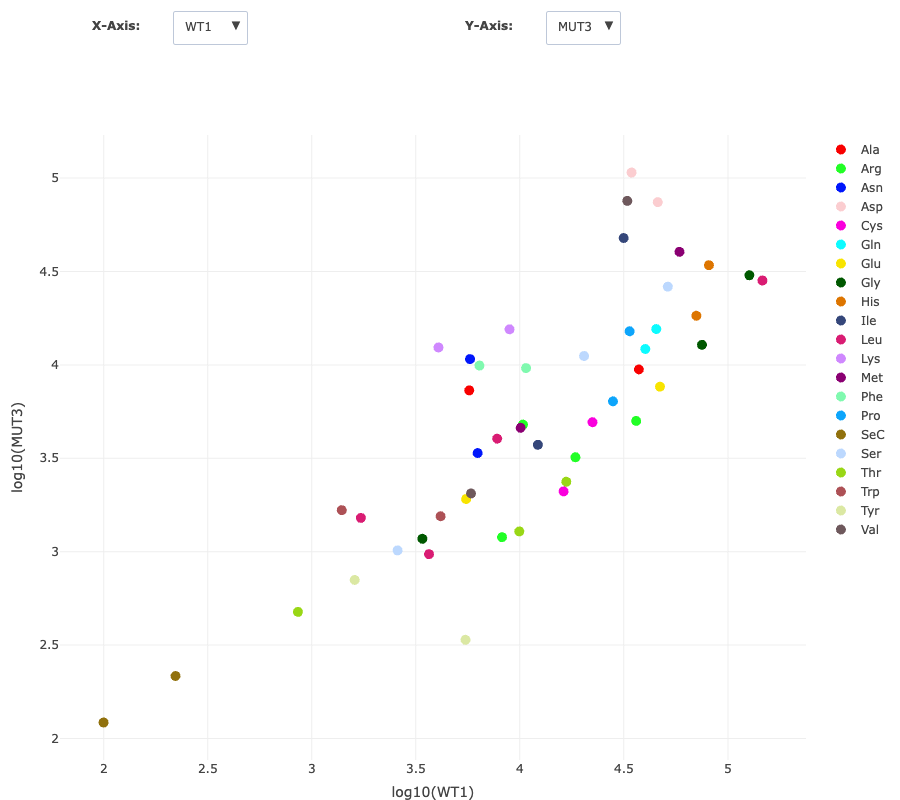
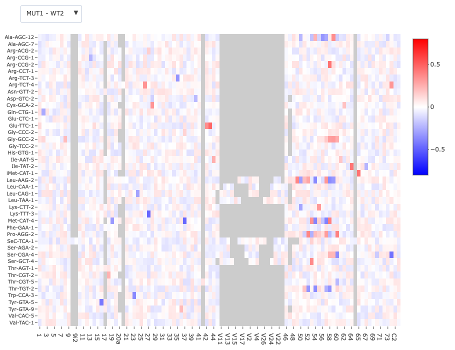
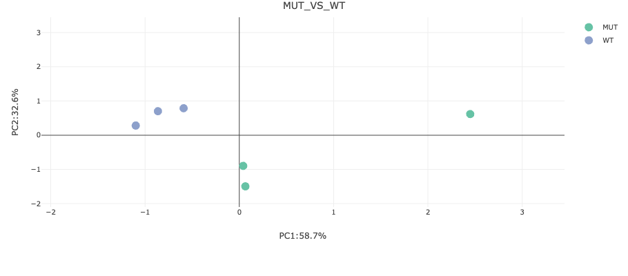
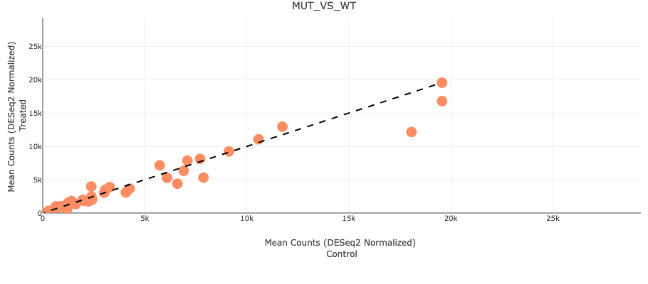
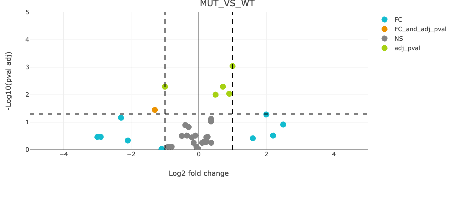
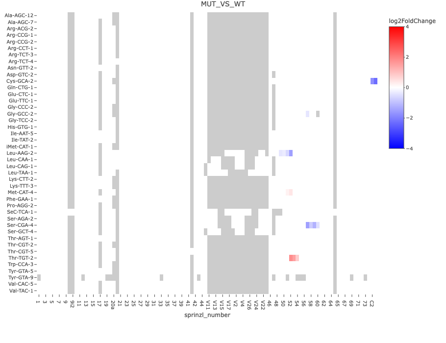

# nano-tRNAseq Module

# Index of Contents

- [Service Overview](#service-overview)
- [Pipeline](#pipeline)
- [Tables](#tables)
  - [Counts Table](#file-countstsv)
  - [Heatmap Base Frequency Table](#file-heatmapbase_freqtsv)
  - [Heatmap Base Frequency Table (Raw Counts)](#file-heatmapbase_freqtsv-1)
- [Visualizations](#visualizations)
  - [Scatterplot: tRNA Abundances for Individual Samples](#scatterplot-visualizing-trna-abundances-for-individual-samples)
  - [Heatmap: Putative tRNA Modifications in Individual Samples](#heatmap-visualizing-putative-trna-modifications-in-individual-samples)
  - [Principal Component Analysis (PCA) Plot](#principal-component-analysis-pca-plot)
  - [Scatterplot: Normalized tRNA Abundances (Treated vs. Control)](#scatterplot-comparing-normalized-trna-abundances-between-treated-and-control-groups)
  - [Volcano Plot: Differential tRNA Abundances (Treated vs. Control)](#volcano-plot-highlighting-differential-trna-abundances-between-treated-and-control-groups)
  - [Heatmap: Log2 Fold Change & Adjusted p-values (Single-Nucleotide Level)](#heatmap-displaying-log2-fold-change-log2fc-and-adjusted-p-values-at-the-single-nucleotide-level-from-differential-trna-modifications-analysis-between-treated-and-control-groups)

  
## Service overview

Our service builds upon the pioneering work at the laboratory of Dr. Eva Novoa (Centre for Genomic Regulation (CRG), Barcelona Institute of Science and Technology, Barcelona, Spain. Their developments harness Oxford Nanopore Technologies (ONT) sequencing systems to directly sequence tRNA, bypassing the need for cDNA/PCR sequencing. With the ONT technology, as a tRNA molecule traverses a protein nanopore, each base generates a unique electrical current, converted into the tRNA sequence. Direct nano-tRNA sequencing comprises the following steps:
 

1. Small RNA isolation: enriched from total RNA
2. tRNA preparation: tRNA-adaptor binding
3. Library preparation: allows for multiplexing of up to 6 samples
4. Sequencing on ONT platform
5. Data analysis: improved base-calling for short RNA sequences.
 
 

## Pipeline

The pipeline consists of four steps:

1. Basecalling – In the first step, basecalling is performed using the POD5 files generated by MinKNOW with Dorado (v0.7.2 or newer). The output is a single BAM file containing the processed reads.

2. Mapping – In the second step, the reads in the BAM file are aligned to the reference tRNA database using Minimap2 (version 2.24 or newer). The result is a single BAM file containing only the aligned reads.

3. Demultiplexing – In the third step, the reads are demultiplexed using the DeMuxnanoT app, producing one BAM file per sample. The pipeline assumes a total of six samples within the library.

4. Quantification & Error Analysis – In the fourth and final step, two key calculations are performed for each sample:

<ul>
<li> The counts of each tRNA present in the reference database.
<li> The basecalling error rate (mismatches with the reference sequence), which can be used to detect RNA modifications.
<ul>

All files—including raw data, BAM files, and tables containing counts and basecalling errors—are stored in the output directory of our service.

## Tables

!! ALL THE NUMBERS REPORTED BELOW ARE FOR PRESENTATION AND THEY DO NOT REFLECT THE REAL EXPERIMENTAL RESULTS !!

### File: counts.tsv

The counts.tsv table contains raw counts for each sample (columns) and each tRNA present in the reference database (rows).

| reference   | Sample1 | Sample2 | Sample3 | Sample4 | Sample5 | Sample6 |
|:------------|:--------|:--------|:--------|:--------|:--------|:--------|
| Ala-AGC-3   | 514     | 440     | 309     | 1059    | 1264    | 1213    |
| Ala-AGC-6   | 612     | 312     | 526     | 651     | 251     | 121     |
| Arg-TCT-1   | 256     | 291     | 36      | 732     | 505     | 1569    |
| ...         | ...     | ...     | ...     | ...     | ...     | ...     |
| Lys-CTT-6   | 728     | 555     | 428     | 262     | 237     | 118     |
| ...         | ...     | ...     | ...     | ...     | ...     | ...     |

### File: heatmap.base_freq.tsv   

In the table heatmap.base_freq.tsv, you can find the sum_err value for each position of the tRNA. This value represents a ratio that quantifies how frequently a base at a specific position was misread compared to the reference tRNA, normalized by the total counts at that position.

| reference   | position | sprinzl number | base | Sample1 sum_err | Sample2 sum_err | Sample3 sum_err | Sample4 sum_err | Sample5 sum_err | Sample6 sum_err |
|:------------|:---------|:----------------|:-----|:------------------|:------------------|:------------------|:------------------|:------------------|:------------------|
| Ala-AGC-3   | 1        |                 | C    | 0.2              | 0.12             | 0.31             | 0.25             | 0.17             | 0.16             |
| Ala-AGC-3   | 2        |                 | C    | 0.4              | 0.12             | 0.6433           | 0.51             | 0.397            | 0.3656           |
| Ala-AGC-3   | 3        |                 | T    | 0.7              | 0.42             | 0.56             | 0.5274           | 0.5792           | 0.59             |
| Ala-AGC-3   | 4        |                 | A    | 0.61             | 0.37             | 0.5408           | 0.5243           | 0.6433           | 0.8317           |
| Ala-AGC-3   | 5        |                 | A    | 0.4941           | 0.4533           | 0.6629           | 0.56             | 0.6343           | 0.71             |
| Ala-AGC-3   | 6        |                 | G    | 0.4778           | 0.5318           | 0.81             | 0.6343           | 0.6924           | 0.7386           |
| Ala-AGC-3   | 7        |                 | A    | 0.4778           | 0.47             | 0.7218           | 0.6271           | 0.5957           | 0.6003           |
| Ala-AGC-3   | 8        |                 | G    | 0.5333           | 0.47             | 0.5957           | 0.5866           | 0.7574           | 0.5783           |
| Ala-AGC-3   | 9        |                 | C    | 0.4273           | 0.42             | 0.5481           | 0.5643           | 0.5777           | 0.5548           |
| Ala-AGC-3   | 10       |                 | A    | 0.7165           | 0.5286           | 0.816            | 0.7715           | 0.8808           | 0.9258           |
| Ala-AGC-3   | 11       |                 | A    | 0.5883           | 0.4984           | 0.5521           | 0.6901           | 0.7401           | 0.685            |
| Ala-AGC-3   | 12       |                 | G    | 0.519            | 0.4617           | 0.6282           | 0.6593           | 0.7121           | 0.624            |
| Ala-AGC-3   | 13       |                 | A    | 0.4689           | 0.309            | 0.5727           | 0.5344           | 0.4777           | 0.5475           |
| Ala-AGC-3   | 14       |                 | A    | 0.3031           | 0.208            | 0.4543           | 0.4153           | 0.396            | 0.4144           |
| Ala-AGC-3   | 15       |                 | G    | 0.3034           | 0.2188           | 0.4148           | 0.3907           | 0.3995           | 0.3812           |
| Ala-AGC-3   | 16       |                 | A    | 0.3299           | 0.2127           | 0.4083           | 0.4069           | 0.4114           | 0.4082           |
| Ala-AGC-3   | 17       |                 | A    | 0.302            | 0.1925           | 0.3954           | 0.4139           | 0.4022           | 0.3932           |
| Ala-AGC-3   | 18       |                 | G    | 0.2778           | 0.2054           | 0.3881           | 0.4093           | 0.405            | 0.3972           |
| Ala-AGC-3   | 19       |                 | C    | 0.2947           | 0.2173           | 0.4096           | 0.436            | 0.4279           | 0.4339           |
| Ala-AGC-3   | 20       |                 | C    | 0.2899           | 0.255            | 0.4093           | 0.4367           | 0.4313           | 0.4087           |
| Ala-AGC-3   | 21       |                 | T    | 0.3038           | 0.2349           | 0.4652           | 0.4344           | 0.4473           | 0.414            |
| Ala-AGC-3   | 22       |                 | G    | 0.3497           | 0.2259           | 0.44             | 0.4476           | 0.4453           | 0.4236           |
| Ala-AGC-3   | 23       |                 | G    | 0.404            | 0.2829           | 0.4999           | 0.5025           | 0.4949           | 0.4662           |
| Ala-AGC-3   | 24       |                 | T    | 0.6286           | 0.4758           | 0.7022           | 0.662            | 0.7102           | 0.6285           |
| Ala-AGC-3   | 25       | 1               | G    | 0.3809           | 0.3553           | 0.5093           | 0.4983           | 0.4915           | 0.5109           |
| Ala-AGC-3   | 26       | 2               | G    | 0.2588           | 0.2572           | 0.3933           | 0.4164           | 0.4163           | 0.4111           |
| Ala-AGC-3   | 27       | 3               | G    | 0.2782           | 0.2112           | 0.3991           | 0.3822           | 0.3752           | 0.3759           |
| Ala-AGC-3   | 28       | 4               | G    | 0.2881           | 0.22             | 0.4222           | 0.4197           | 0.4083           | 0.4112           |
| Ala-AGC-3   | 29       | 5               | G    | 0.3824           | 0.2612           | 0.4761           | 0.4544           | 0.453            | 0.4673           |
| Ala-AGC-3   | 30       | 6               | T    | 0.3009           | 0.2166           | 0.4055           | 0.4052           | 0.3877           | 0.3937           |
| Ala-AGC-3   | 31       | 7               | G    | 0.3602           | 0.2862           | 0.4437           | 0.4857           | 0.4647           | 0.493            |
| Ala-AGC-3   | 32       | 8               | T    | 0.5165           | 0.4519           | 0.6276           | 0.6381           | 0.6421           | 0.624            |
| Ala-AGC-3   | 33       | 9               | A    | 0.7813           | 0.707            | 0.8453           | 0.8713           | 0.8589           | 0.8941           |
| ...         | ...      | ...             | ...  | ...              | ...              | ...              | ...              | ...              | ...              |
| Glu-CTC-1   | 25       | 1               | T    | 0.3809           | 0.3553           | 0.5093           | 0.4983           | 0.4915           | 0.5109           |
| Glu-CTC-1   | 26       | 2               | C    | 0.2588           | 0.2572           | 0.3933           | 0.4164           | 0.4163           | 0.4111           |
| Glu-CTC-1   | 27       | 3               | C    | 0.2782           | 0.2112           | 0.3991           | 0.3822           | 0.3752           | 0.3759           |
| ...         | ...      | ...             | ...  | ...              | ...              | ...              | ...              | ...              | ...              |

- **reference:** Name of reference tRNA
- **position:** Position in the tRNA containing the sequencing adapter. The first 24 positions in this column correspond to the adapter.
- **sprinzl_number:** The Sprinzl number refers to a numbering system used for tRNA sequences to identify the positions of nucleotides in a standardized way. This numbering system was introduced by Reinhold Sprinzl and colleagues to provide a consistent framework for comparing different tRNA sequences.
In this case, the first 24 positions of the "position" column, corresponding to the adapter, are not taken into account.
- **base:** Corresponding base to the reference tRNA used in the database.
- **Sample sum_err:** The sum_err is calculated for each tRNA position in every sample. It represents a ratio that quantifies how often a base at a specific position was misread compared to the reference tRNA, normalized by the total counts for that position. 

### File: heatmap.base_count.tsv   

In the table heatmap.base_count.tsv, you can find, for each sample and each tRNA position, the number of times a specific base (A, T, G, or C) was read (raw counts) compared to the reference tRNA. Additionally, the table includes counts for insertions and deletions at each specific position.

| reference     | position | sprinzl number | base | Sample1 A | Sample1 T | Sample1 G | Sample1 C | Sample1 insertion | Sample1 deletion |
|:-------------|:---------|:----------------|:-----|:----------|:----------|:----------|:----------|:------------------|:------------------|
| Ala-AGC-3    | 1        |                | C    | 3         | 1         | 0         | 7         | 1                 | 1                 |
| Ala-AGC-3    | 2        |                | C    | 1         | 1         | 0         | 8         | 1                 | 2                 |
| Ala-AGC-3    | 3        |                | T    | 1         | 6         | 0         | 2         | 1                 | 5                 |
| Ala-AGC-3    | 4        |                | A    | 7         | 0         | 2         | 1         | 1                 | 4                 |
| Ala-AGC-3    | 5        |                | A    | 10        | 1         | 1         | 2         | 3                 | 2                 |
| Ala-AGC-3    | 6        |                | G    | 0         | 2         | 13        | 1         | 1                 | 3                 |
| Ala-AGC-3    | 7        |                | A    | 12        | 0         | 2         | 2         | 2                 | 3                 |
| Ala-AGC-3    | 8        |                | G    | 0         | 3         | 13        | 3         | 0                 | 1                 |
| Ala-AGC-3    | 9        |                | C    | 2         | 1         | 1         | 68        | 1                 | 19                |
| Ala-AGC-3    | 10       |                | A    | 43        | 3         | 1         | 23        | 1                 | 21                |
| Ala-AGC-3    | 11       |                | A    | 62        | 9         | 5         | 4         | 1                 | 26                |
| Ala-AGC-3    | 12       |                | G    | 1         | 0         | 75        | 4         | 4                 | 35                |
| Ala-AGC-3    | 13       |                | A    | 86        | 5         | 6         | 6         | 2                 | 16                |
| Ala-AGC-3    | 14       |                | A    | 175       | 5         | 4         | 0         | 1                 | 12                |
| Ala-AGC-3    | 15       |                | G    | 1         | 3         | 206       | 1         | 2                 | 21                |
| Ala-AGC-3    | 16       |                | A    | 202       | 5         | 5         | 3         | 1                 | 18                |
| Ala-AGC-3    | 17       |                | A    | 220       | 3         | 8         | 2         | 1                 | 15                |
| Ala-AGC-3    | 18       |                | G    | 0         | 1         | 234       | 2         | 3                 | 17                |
| Ala-AGC-3    | 19       |                | C    | 1         | 5         | 8         | 235       | 5                 | 15                |
| Ala-AGC-3    | 20       |                | C    | 3         | 3         | 5         | 248       | 6                 | 16                |
| Ala-AGC-3    | 21       |                | T    | 3         | 249       | 3         | 1         | 12                | 23                |
| Ala-AGC-3    | 22       |                | G    | 5         | 0         | 249       | 1         | 2                 | 39                |
| Ala-AGC-3    | 23       |                | G    | 3         | 3         | 237       | 3         | 2                 | 55                |
| Ala-AGC-3    | 24       |                | T    | 18        | 171       | 19        | 14        | 5                 | 82                |
| Ala-AGC-3    | 25       | 1              | G    | 10        | 1         | 228       | 5         | 4                 | 39                |
| Ala-AGC-3    | 26       | 2              | G    | 6         | 1         | 269       | 2         | 4                 | 12                |
| Ala-AGC-3    | 27       | 3              | G    | 7         | 2         | 269       | 3         | 2                 | 14                |
| Ala-AGC-3    | 28       | 4              | G    | 3         | 8         | 266       | 1         | 4                 | 18                |
| Ala-AGC-3    | 29       | 5              | G    | 33        | 2         | 238       | 1         | 5                 | 20                |
| Ala-AGC-3    | 30       | 6              | T    | 2         | 276       | 2         | 5         | 10                | 24                |
| Ala-AGC-3    | 31       | 7              | G    | 5         | 3         | 278       | 3         | 6                 | 46                |
| Ala-AGC-3    | 32       | 8              | T    | 3         | 262       | 7         | 0         | 24                | 123               |
| Ala-AGC-3    | 33       | 9              | A    | 148       | 8         | 66        | 3         | 5                 | 137               |
| Ala-AGC-3    | 34       | 10             | G    | 59        | 4         | 188       | 10        | 18                | 104               |
| Ala-AGC-3    | 35       | 11             | C    | 16        | 38        | 28        | 194       | 15                | 89                |
| Ala-AGC-3    | 36       | 12             | T    | 13        | 295       | 5         | 15        | 15                | 84                |
| Ala-AGC-3    | 37       | 13             | C    | 12        | 43        | 9         | 246       | 17                | 82                |
| Ala-AGC-3    | 38       | 14             | A    | 213       | 24        | 56        | 17        | 14                | 85                |
| Ala-AGC-3    | 39       | 15             | G    | 35        | 6         | 307       | 6         | 30                | 43                |
| Ala-AGC-3    | 40       | 16             | T    | 6         | 301       | 5         | 43        | 42                | 79                |
| Ala-AGC-3    | 41       | 18             | G    | 36        | 12        | 272       | 3         | 24                | 76                |
| Ala-AGC-3    | 42       | 19             | G    | 22        | 18        | 297       | 18        | 28                | 63                |
| Ala-AGC-3    | 43       | 20             | T    | 19        | 191       | 19        | 101       | 21                | 68                |
| Ala-AGC-3    | 44       | 21             | A    | 309       | 6         | 33        | 7         | 12                | 48                |
| Ala-AGC-3    | 45       | 22             | G    | 2         | 5         | 334       | 25        | 14                | 30                |
| Ala-AGC-3    | 46       | 23             | A    | 347       | 8         | 10        | 4         | 10                | 73                |
| Ala-AGC-3    | 47       | 24             | G    | 18        | 4         | 301       | 5         | 5                 | 70                |
| ...          | ...      | ...            | ...  | ...       | ...       | ...       | ...       | ...               | ...               |
| Glu-CTC-1    | 25       | 1              | T    | 121       | 231       | 222       | 122       | 124               | 221               |
| Glu-CTC-1    | 26       | 2              | C    | 112       | 256       | 256       | 222       | 213               | 242               |
| Glu-CTC-1    | 27       | 3              | C    | 144       | 237       | 242       | 234       | 121               | 342               |
| ...          | ...      | ...            | ...  | ...       | ...       | ...       | ...       | ...               | ...               |

- **reference:** Name of reference tRNA
- **position:** Position in the tRNA containing the sequencing adapter. The first 24 positions in this column correspond to the adapter.
- **sprinzl_number:** The Sprinzl number refers to a numbering system used for tRNA sequences to identify the positions of nucleotides in a standardized way. This numbering system was introduced by Reinhold Sprinzl and colleagues to provide a consistent framework for comparing different tRNA sequences.
In this case, the first 24 positions of the "position" column, corresponding to the adapter, are not taken into account.
- **base:** Corresponding base to the reference tRNA used in the database.
- **Sample A/T/G/C/insertion/deletion:** number of times a specific base (A, T, G, or C) was read (raw counts) compared to the reference tRNA. Additionally, the table includes counts for insertions and deletions at each specific position.

### Scatterplot Visualizing tRNA Abundances for Individual Samples
In this analysis, counts from different isoacceptors of the same tRNA are combined to represent its total abundance.
 

 

### Heatmap Visualizing Putative tRNA Modifications in Individual Samples
A heatmap visualizing the ratio of basecalling errors between two samples, highlighting regions with significant differences to enhance comparative analysis and interpretation.
 

 

### Principal Component Analysis (PCA) plot
PCA transforms high-dimensional data into a smaller number of principal components (PCs), which explain most of the variance.
 

 

- **Table: Comparison1_PCA.txt:** This table contains the PCA values for the specific comparison (e.g., Treatment vs. Control).
 

### Scatterplot Comparing normalized tRNA Abundances Between Treated and Control Groups
This scatterplot compares the mean of normalized counts (DESeq2) between two groups, such as Treatment vs. Control. The counts corresponding to the various isoacceptors of a specific tRNA are aggregated to provide a unified representation of its overall abundance.
 

 

- **Table Comparison1_Scatterplot_Normalized_Abundance_tRNA.txt:**This table contains the mean DESeq2-normalized counts values used to generate the scatter plot for the specific comparison (e.g., Treatment vs. Control)

 

### Volcano Plot Highlighting Differential tRNA abundances Between Treated and Control Groups
This volcano plot illustrates the log2 fold change (log2FC) and adjusted p-value calculated on the abundances of each tRNA in the Treatment vs. Control comparison. The counts corresponding to different isoacceptors of a specific tRNA have been aggregated to provide a comprehensive representation of its overall abundance.
 

 

- **Table Comparison1_Volcano_DEGs_RAW_counts_tRNA.txt:**  This table contains the raw counts used to calculate differentially expressed genes (DEGs) among various tRNAs for the specified comparison (e.g., Treatment vs. Control).

 

- **Table Comparison1_Volcano_DEGs_Norm_counts_tRNA.txt:** This table contains the DESeq2-normalized count used to calculate differentially expressed genes (DEGs) among various tRNAs for the specified comparison (e.g., Treatment vs. Control).

 

- **Table Comparison1_Volcano_DEGs_Pval_and_FC_tRNA.txt:** This table contains the log2FC, p-value, and adjusted p-value used to generate the volcano plot for the specified comparison (e.g., Treatment vs. Control).

 

### Heatmap Displaying Log2 Fold Change (log2FC) and Adjusted p-values at the Single-Nucleotide Level from Differential tRNA Modifications Analysis Between Treated and Control Groups
This heatmap displays the log2 fold change (log2FC) and adjusted p-value (p-adj) calculated using DESeq2 for each position of every amino acid, comparing the Treatment and Control groups.
 

 

- **Table: Comparison1_heatMapFull_tRNA_Modifications_DEGs.txt:** This table contains the log2 fold change (log2FC), p-value, and adjusted p-value calculated using DESeq2 for each position of every individual tRNA in the specified comparison (e.g., Treatment vs. Control). It is used to generate the heatmap.

 

