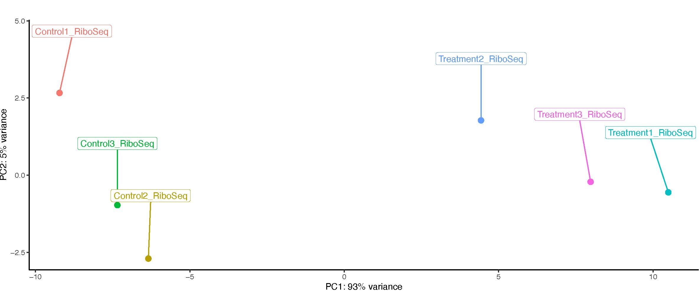
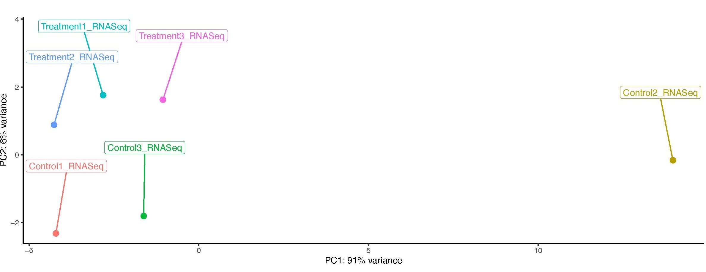
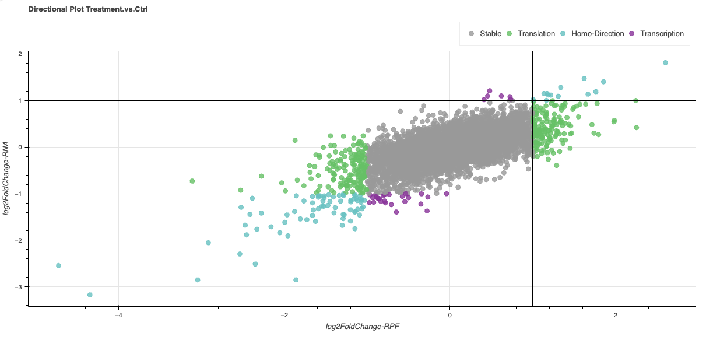

# Translation Efficiency Module

- [Translation Efficiency Module](#translation-efficiency-module)
- [Results](#results)
- [Tables](#tables)
  - [counts.txt](#countstxt)
  - [DifferentialExpression.txt](#differentialexpressiontxt)
  - [directionalPlotData.tsv](#directionalplotdatatsv)
- [Plots](#plots)
  - [Principal Component Analysis (PCA) Plots](#principal-component-analysis-pca-plots)
  - [Volcano Plot](#volcano-plot)
  - [Directional Plot](#directional-plot)
  
**Translation Efficiency (TE)** is a method for identifying differentially expressed genes across conditions by accounting for both transcriptional and translational regulation. Unlike **Differential Expression (DE)**, which compares gene expression levels between conditions within a single sequencing type (Ribo-Seq or RNA-Seq), TE analyzes the interaction between sequencing type and condition. Since the number of Ribosome Protected Fragments (RPFs) on a gene is strongly influenced by mRNA abundance, a simple DE analysis on Ribo-Seq data may not accurately reflect changes in protein production. TE addresses this by normalizing RPF counts based on corresponding RNA-Seq data, providing a more precise measure of translational regulation. For a deeper understanding of TE, refer to Chothani et al., "deltaTE: Detection of Translationally Regulated Genes by Integrative Analysis of Ribo-seq and RNA-seq Data" (https://doi.org/10.1002/cpmb.108).  
Our Translation Efficiency workflow is as follows:  
 

## Results:

The Translation Efficiency analysis results include graphs, Differential Expression table,directional Plot table , and count tables for each sample.

## Tables

### counts.txt

| geneID         | Control1.Riboseq | Control2.Riboseq | Control3.Riboseq | Treatment1.Riboseq | Treatment2.Riboseq | Treatment3.Riboseq | Control1.RNAseq | Control2.RNAseq | Control3.RNAseq | Treatment1.RNAseq | Treatment2.RNAseq | Treatment3.RNAseq |
|----------------|------------------|------------------|------------------|--------------------|--------------------|--------------------|-----------------|-----------------|-----------------|-------------------|-------------------|-------------------|
| ENSG000000012345 | 400              | 380              | 415              | 600                | 590                | 610                | 1200            | 1185            | 1220            | 1500              | 1490              | 1515              |
| ENSG000000067890 | 1500             | 1480             | 1520             | 2200               | 2195               | 2210               | 3100            | 3050            | 3120            | 4200              | 4195              | 4215              |
| ENSG000000001234 | 70               | 72               | 68               | 110                | 115                | 108                | 250             | 245             | 260             | 400               | 395               | 410               |
... | ... | ... | ... | ... | ... | ... | ... | ... | ... | ... | ... | ...

This table reports the raw counts generated with htseq-count (https://htseq.readthedocs.io/en/release_0.11.1/count.html
) for each gene across all Riboseq and RNAseq samples. The resulting count matrix is used as input for the differential expression analysis.

### DifferentialExpression.txt

geneID | baseMean | log2FoldChange | lfcSE | stat | pvalue | padj
--- | --- | --- | --- | --- | --- | ---
ENSG000000012345 | 400 | 0.22 | 0.10 | 2 | 0.05 | 0.1
ENSG000000067890 | 1500 | -1.2 | 0.11 | -9.4 | 1.8e-20 | 3.01e-19
ENSG000000001234 | 70 | 0.53 | 0.7 | 0.8 | 0.401 | 1
... | ... | ... | ... | ... | ... | ... 

This table summarizes the Translation Efficiency analysis results. P-adjusted values were calculated using the Benjamini-Hochberg method. For detailed information about the values in the table, refer to the DESeq2 vignette (https://bioconductor.org/packages/release/bioc/vignettes/DESeq2/inst/doc/DESeq2.html)

### directionalPlotData.tsv

geneID | baseMean.RiboSeq | log2FoldChange.RiboSeq | lfcSE.RiboSeq | stat.RiboSeq | pvalue.RiboSeq | padj.RiboSeq | baseMean.RNASeq | log2FoldChange.RNASeq | lfcSE.RNASeq | stat.RNASeq | pvalue.RNASeq | padj.RNASeq
--- | --- | --- | --- | --- | --- | --- | --- | --- | --- | --- | --- | --- 
ENSG000000012345 | 400 | 0.22 | 0.10 | 2 | 0.05 | 0.1 | 410 | -0.2 | 0.18 | -1.2 | 0.25 | 0.9 
ENSG000000067890 | 1500 | -1.2 | 0.11 | -9.4 | 1.8e-20 | 3.01e-19 | 8123 | 0.0005 | 0.2 | 0.07 | 0.9 | 0.99
ENSG000000001234 | 70 | 0.53 | 0.7 | 0.8 | 0.401 | 1 | 77 | -1.2 | 0.8 | -1.5 | 0.16 | 1 
... | ... | ... | ... | ... | ... | ... | ... | ... | ... | ... | ... | ... 

This table presents **Differential Expression (DE)** results for both **Ribo-Seq** and **RNA-Seq** data. Columns ending in ".RiboSeq" correspond to Ribo-Seq results, while those ending in ".RNASeq" pertain to RNA-Seq results. 

**Importantly, these DE analyses are independent of the Translation Efficiency analysis** and do not involve normalization across sequencing types. They assess gene level up- or down-regulation within each sequencing type (Treatment vs. Control). Consequently, log2 Fold Changes and p-values may differ from the TE analysis. The logic of this analysis to identify genes those up- and/or down-regulated in either translation or transcription and label them by comparing the log2 Fold Changes in the RNA-Seq and Ribo-Seq. The genes movements are labeled with respect to table below;

 

Description | Movement
--- | ---
log2FoldChannge RNASeq >= 1 and log2 FoldChange RiboSeq >= 1 | **"Homo-Direction"**
log2FoldChannge RNASeq <= -1 and log2 FoldChange RiboSeq <= -1 | **"Homo-Direction"**
log2FoldChannge RNASeq >= 1 and log2 FoldChange RiboSeq <= -1 | **"Cross-Direction"**
log2FoldChannge RNASeq <= -1 and log2 FoldChange RiboSeq >= 1 | **"Cross-Direction"**
log2FoldChannge RNASeq is between (-1,1) and log2 FoldChange RiboSeq >= 1 | **"Translation"**
log2FoldChannge RNASeq is between (-1,1) and log2 FoldChange RiboSeq <= -1 | **"Translation"**
log2FoldChannge RNASeq >= 1 and log2 FoldChange RiboSeq is between (-1,1) | **"Transcription"**
log2FoldChannge RNASeq <= -1 and log2 FoldChange RiboSeq is between (-1,1) | **"Transcription"**
log2FoldChannge RNASeq is between (-1,1) and log2 FoldChange RiboSeq is between (-1,1) | **"Stable"**

## Plots

## Principal Component Analysis (PCA) Plots

The results include three PCA plots: *Sample*, *RNASeq*, and *RiboSeq*.  
The *Sample* plot visualizes the PCA analysis of all samples (Ribo-Seq and RNA-Seq for both Control and Treated groups).  
The *RNASeq* and *RiboSeq* plots show PCA results for the respective data types alone.

### All Samples

### Riboseq

### RNAseq

## Volcano Plot

Volcano plots shows DEGs between Treatment and Control in Riboseq or RNAseq or Translation Efficiency data. Each point corresponds to a gene, plotted based on its log2 Fold Change (x-axis) and adjusted p-value (y-axis, -log10 scale, Benjamini-Hochberg method). (log2FC > 1 or log2FC < -1) and adjusted p-value <0.05.

## Directional Plot

This scatter plot visualizes differential gene expression between Ribo-Seq and RNA-Seq data. Each dot represents a gene, positioned based on its log2FoldChange in Ribo-Seq (x-axis) and RNA-Seq (y-axis). Genes are labeled according to their differential expression patterns.

